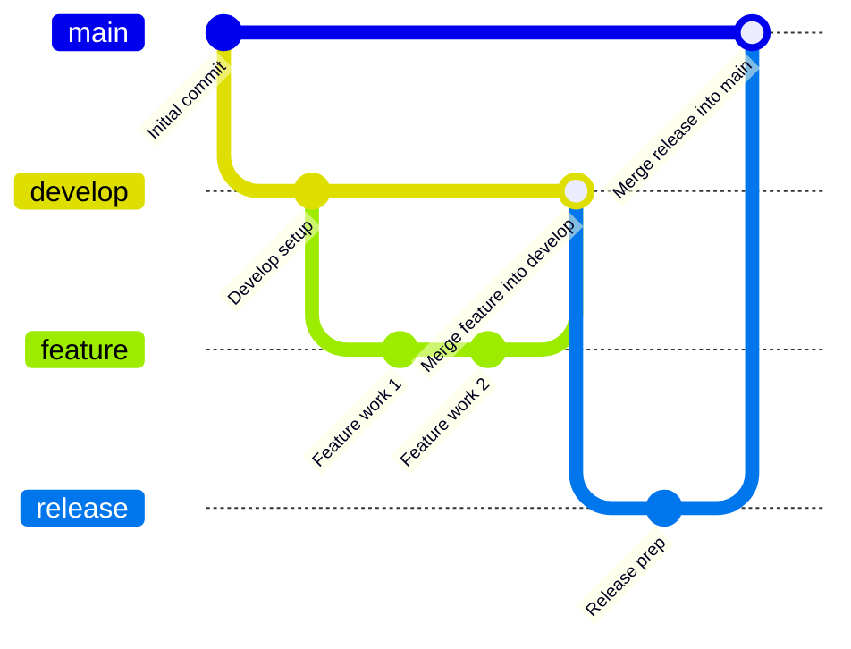

# Python_security_scanner
A highly configurable command-line utility designed to audit repositories and local directories for leaked credentials, API keys, and hardcoded passwords using the 'detect_secrets' core analysis plugins.
Here is a comprehensive, professional README.md for your script. It covers everything from installation to production deployment, and includes a detailed Contributing section structured around the Gitflow branching model.

Secret Scanner CLI
A robust, PEP 8-compliant command-line utility designed to scan local directories and repositories recursively for leaked credentials, API keys, and hardcoded secrets. Powered by the detect-secrets analysis engine, this script is optimized for standalone use or integration into CI/CD pipelines.

Features
Recursive Scanning: Deep-scans directories for private keys, high-entropy strings, and explicit passwords.

Smart Performance: Dynamically prunes directory traversal (e.g., ignoring .git and node_modules) to maximize scanning speed.

CI/CD Ready: Automatically exits with status code 1 if secrets are detected, making it perfect for failing builds in GitHub Actions, GitLab CI, or pre-commit hooks.

Verbose Mode: Debug logging to trace exactly which files are being evaluated or skipped.

Installation
Clone the Repository:

Bash
git clone https://github.com/your-username/secret-scanner.git
cd secret-scanner
Install Dependencies:
This script requires Python 3.8+ and the detect-secrets core package.

Bash
   pip install detect-secrets
Usage
Run the scanner by pointing it to any target directory. If no directory is provided, it defaults to the current directory (.).

Basic Command
Bash
python secret_scanner.py /path/to/your/project
Advanced Options
Bash
# Scan the current directory with verbose debug logs
python secret_scanner.py . --verbose

# Exclude custom directories from the scan
python secret_scanner.py . --exclude build dist artifacts

# View the full help menu
python secret_scanner.py --help
Exit Codes
The script communicates its results using standard OS exit codes:

0: Scan complete. No secrets found.

1: Security Alert. One or more secrets were detected (fails CI/CD pipelines).

130: Scan was canceled prematurely by the user (Ctrl+C).

Contributing
We welcome contributions! To keep our codebase clean, predictable, and production-ready, this project strictly adheres to the Gitflow Workflow.

Branching Model
We maintain two permanent branches and utilize temporary tracking branches:

main: Reflects the production-ready state. Code here is stable, heavily tested, and tagged with version releases. Never commit directly to main.

develop: The integration branch for features. This is where day-to-day development aggregation happens.

feature/*: Temporary branches used to develop specific new features or fixes. They branch off develop and must merge back into develop.

